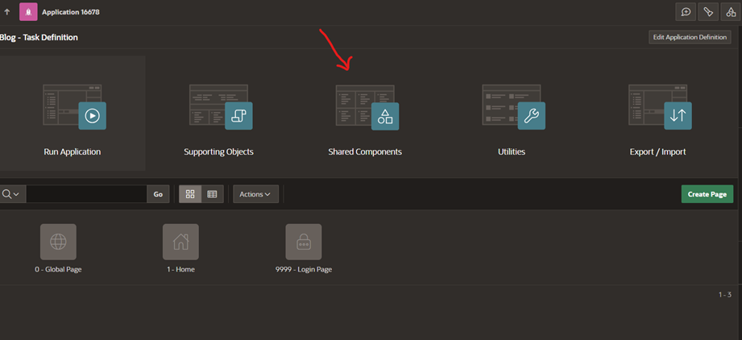
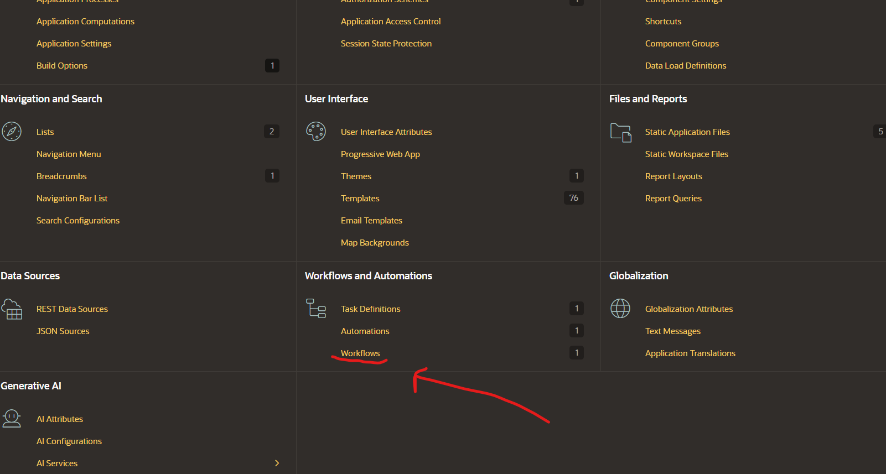
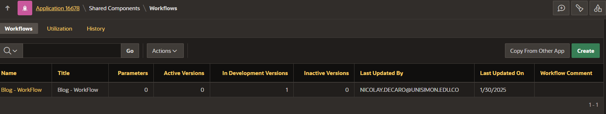
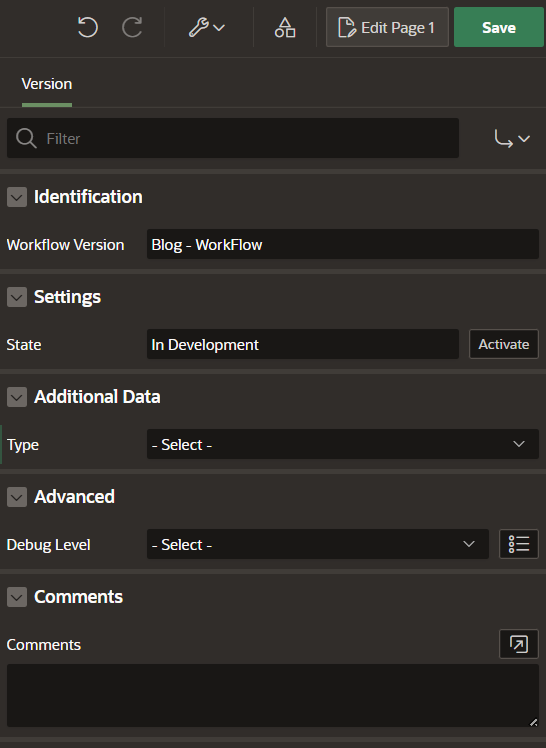
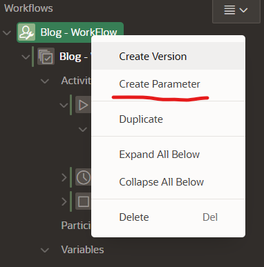
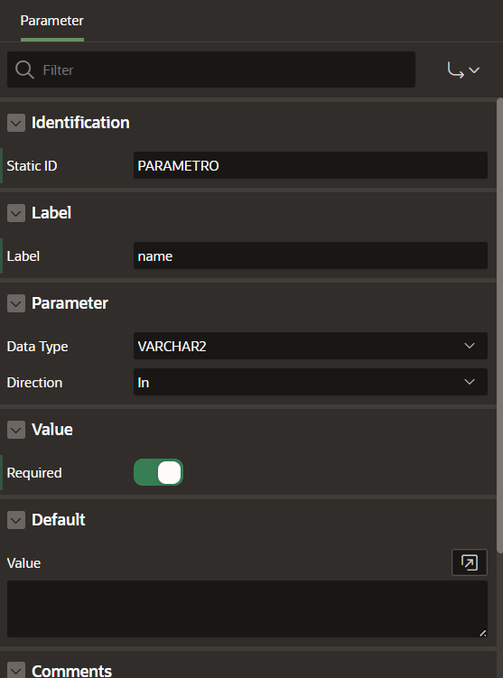

# Tabla de Contenidos  

1. **Introducción**  
2. **Crea un flujo de trabajo en tu Workspace en Oracle APEX**  
   - 2.1. Versiones de flujo de trabajo  
3. **Parámetros**  
4. **Actividades**  
   - 4.1. Activity Variables en APEX Workflows  
   - 4.2. Opciones para Crear Actividades en un Workflow  
   - 4.2.1 Reglas de Conexión entre Actividades
   - 4.3. Roles en Workflows y Tareas en Oracle APEX  
   - 4.4. Vistas de Workflow en Oracle APEX  
   - 4.4.1 Workflow Metadata Views
   - 4.4.2 Workflow Runtime Views
5. **Conclusión**  

# 1. Introducción  
Workflow, o flujo de trabajo, es la forma en que se organizan y ejecutan las tareas dentro de un proceso.  
Permite automatizar actividades y visualizar su progreso en tiempo real.  
En este blog, exploraremos su importancia y funcionamiento.  

# 2. Crea un flujo de trabajo en tu Workspace en Oracle APEX  
Esta guía es una continuación de *Automatización en Oracle APEX v24 - Parte I*, por lo que utilizaremos la aplicación **Blog - Task Automation**. Una vez dentro de la aplicación, accedemos a **Shared Components** y seleccionamos **Automations**.  

Después de hacer clic en Workflow, selecciona Create para iniciar la creación de un nuevo flujo de trabajo.

Después de crear nuestro flujo de trabajo, debemos asignarle una identificación en los campos **Name** y **Title**.  
En nuestro caso, es **Blog - WorkFlow**.  

## 2.1 Versiones de Flujo de Trabajo  
Una versión de Workflow puede estar en tres estados: **En desarrollo**, **Activa** o **Inactiva**.  

- **En desarrollo**: Es editable y solo se puede ejecutar en la sesión del desarrollador. Solo puede haber una versión en desarrollo.  
- **Activa**: Es parcialmente editable y solo puede haber una versión activa. No puede volver a desarrollo.  
- **Inactiva**: No se puede usar para nuevas instancias, pero las instancias en ejecución continúan hasta completarse. Se pueden eliminar o duplicar versiones inactivas.  

Cuando se crea un workflow, comienza en **En desarrollo**.  
Al moverlo a **Activo**, la versión activa anterior pasa a **Inactiva**.  

| **Sección**         | **Descripción** |
|---------------------|----------------|
| **Identification** | **Workflow version**: Define el nombre de la versión específica del flujo de trabajo. En este caso, se llama **Blog-WorkFlow**. Es importante para diferenciar entre distintas versiones. |
| **Settings**       | **State (Estado)**: Define el estado actual de la versión del flujo de trabajo.   - **In Development**: Editable, solo ejecutable en desarrollo.   - **Active**: Ejecutable en producción, pero no puede volver a desarrollo.   - **Inactive**: No activa, no inicia nuevos workflows, pero se pueden eliminar o duplicar versiones inactivas. |
| **Additional Data** | **Type**: Define cómo obtener datos adicionales para evaluar variables y condiciones.   - **Table / View**: Usa una tabla o vista en la base de datos.   - **SQL Query**: Obtiene datos mediante una consulta SQL personalizada. |
| **Advance**        | **Debug Level**: Define el nivel de depuración del flujo de trabajo.   - **Info**: Nivel predeterminado, sin detalles específicos.   - **Warning**: Registra advertencias sin interrumpir el flujo.   - **Error**: Registra errores críticos que detienen el proceso.   - **Trace**: Nivel más detallado, registra funciones y procedimientos. |
| **Comments**       | **Comments**: Permite agregar notas visibles solo en el **App Builder**. Útil para documentar el flujo de trabajo. |

# 3. Parámetros
Es importante tener en cuenta que un flujo de trabajo puede tener varios parámetros de distintos tipos de datos.  
Estos se pueden definir dentro del flujo de trabajo haciendo clic derecho sobre el flujo de trabajo.  

Al crear un parametro nos aparecera al lado izquierdo los atributos disponibles para el parametro

| **Parámetro**         | **Descripción** |
|-----------------------|----------------|
| **Identification**    | Indica si el parámetro debe ser proporcionado siempre al ejecutar el flujo de trabajo. Si es requerido, debe estar presente para que el flujo funcione correctamente. |
| **Label**            | El nombre amigable que el usuario verá para identificar el parámetro en la interfaz. Debe ser fácil de entender para los usuarios finales. |
| **Additional Information** | **Type:** Campo para agregar información adicional sobre el parámetro, como su propósito o instrucciones.   **Supported Substitutions:** Se pueden usar sustituciones dinámicas dentro del parámetro, como valores de la aplicación, elementos de la página o variables del sistema. |
| **Parameter**        | **Data Type:** Define el tipo de datos esperado. Opciones incluyen:   - `VARCHAR2`: Cadena de texto   - `TIMESTAMP`: Marca de tiempo   - `NUMBER`: Número   - `BOOLEAN`: Valor verdadero/falso   - `CLOB`: Texto grande   **Direction:** Cómo se usa el parámetro en el flujo de trabajo:   - **In:** Solo se pasa al flujo de trabajo.   - **Out:** Solo sale del flujo de trabajo.   - **In/Out:** Se pasa al flujo y también se recupera.   **Value:** El valor asignado al parámetro, que puede ser dinámico o estático. |
| **Default Value**    | El valor predeterminado que se utilizará si no se proporciona otro valor al ejecutar el flujo de trabajo. Evita errores si el parámetro no se establece explícitamente. |
| **Additional Information** | **Type:** Campo de texto para ingresar información adicional sobre el parámetro.   **Supported Substitutions:** Se pueden usar valores dinámicos de la aplicación, elementos de la página y variables del sistema dentro del parámetro, ofreciendo flexibilidad. |

# 4. Actividades
Flujo de trabajos pueden tener varias actividades como enviar correo electrónico o una definición de tarea, continuacion presentaremos las actividades disponibles:
| **Actividad**              | **Descripción** |
|---------------------------|----------------|
| **Workflow Start**        | Es la actividad inicial que arranca el flujo de trabajo. Se coloca al principio del proceso y no puede ser precedida por ninguna otra actividad. |
| **Workflow End**          | Marca el final de un flujo de trabajo o de una rama del mismo. Cuando se alcanza, el flujo de trabajo termina y no se ejecutan más actividades. |
| **Workflow Switch**       | Permite definir ramas condicionales dentro del flujo de trabajo. En base a ciertas condiciones, se puede redirigir el flujo a diferentes actividades. |
| **Workflow Wait**         | Introduce una pausa en la ejecución del flujo de trabajo. Se puede configurar para esperar hasta que se cumpla una condición o pase un período de tiempo determinado. |
| **Human Task**           | Crea una tarea que se asigna a un usuario para que realice una acción manual. Se vincula a una definición de tarea preexistente en el sistema. |
| **Invoke API**           | Llama a una API externa para realizar alguna acción. |
| **Invoke Workflow**      | Ejecuta otro flujo de trabajo dentro del mismo aplicativo, permitiendo crear flujos complejos que dependen de otros flujos previamente definidos. |
| **Execute Code**        | Permite ejecutar código SQL o PL/SQL directamente dentro del flujo de trabajo. Se usa para operaciones específicas o cálculos durante la ejecución del flujo. |
| **Send Email**          | Envía un correo electrónico como parte del flujo de trabajo, útil para notificar a usuarios o sistemas sobre eventos específicos. |
| **Send Push Notification** | Envía una notificación push a una aplicación o dispositivo móvil asociado. Se usa para alertar a los usuarios en tiempo real sobre acciones o cambios en el flujo de trabajo. |

## 4.1. Activity Variables en APEX Workflows  
Cada actividad en un Workflow puede manejar **Activity Variables**, que son valores asociados a la actividad y pueden utilizarse para:

- **Guardar información temporalmente**, como el estado de una tarea.  
- **Pasar datos entre actividades**, como el usuario asignado a una tarea.  
- **Determinar condiciones en un Workflow Switch**, permitiendo definir qué camino seguir. 

## 4.2. Opciones para Crear Actividades en un Workflow
Al diseñar un flujo de trabajo, APEX permite agregar nuevas actividades en diferentes posiciones dentro del diagrama:

1. **Create Activity Below**  
   - Permite agregar una nueva actividad después de la actividad seleccionada.  
   - Se usa para continuar el flujo normal del proceso.  
   - No se puede usar en **Workflow End**, ya que esta actividad finaliza el flujo.  

2. **Create Activity After**  
   - Similar a **Below**, pero coloca la nueva actividad como un paso independiente.  
   - Es útil cuando una actividad puede derivar en dos caminos diferentes.  

3. **Create Connection**  
   - Permite conectar actividades entre sí para definir el orden de ejecución.  
   - No se puede conectar a **Workflow End**, ya que esta actividad no permite conexiones posteriores.  

### 4.2.1 Reglas de Conexión entre Actividades

| Desde → Hacia                        | ¿Es posible? | Notas |
|--------------------------------------|-------------|------------------------------------------------|
| **Workflow Start → Otra actividad** | ✅ Sí        | La actividad de inicio siempre se conecta a otra. |
| **Actividad Cualquiera → Workflow End** | ✅ Sí    | Marca el final del flujo. |
| **Workflow End → Otra actividad** | ❌ No        | No se puede conectar después del End. |
| **Workflow Switch → Varias actividades** | ✅ Sí | Se pueden definir rutas condicionales. |
| **Invoke Workflow → Otra actividad** | ✅ Sí | Se pueden ejecutar workflows secundarios antes de continuar. |
| **Send Email → Otra actividad** | ✅ Sí | Después de una notificación, el flujo puede continuar. |
| **Execute Code → Otra actividad** | ✅ Sí | El flujo continúa después de ejecutar código PL/SQL. |

## 4.3. Roles en Workflows y Tareas en Oracle APEX
En Oracle APEX, los roles en Workflows determinan qué acciones puede realizar cada usuario dentro de una instancia de flujo de trabajo.

### Principales Roles:
- **Workflow Owners**  
  - Pueden iniciar, terminar y reintentar un Workflow si ocurre un error.  

- **Workflow Administrators**  
  - Tienen permisos avanzados para suspender, reanudar y modificar variables de un Workflow en ejecución.  

## 4.4. Vistas de Workflow en Oracle APEX
Las vistas de Workflow en Oracle APEX permiten acceder a información sobre la definición, ejecución y monitoreo de Workflows en la base de datos.  

Se dividen en:  
- **Metadata Views (Vistas de Metadatos)**: Contienen información sobre la estructura y configuración de los Workflows.  
- **Runtime Views (Vistas en Tiempo de Ejecución)**: Proporcionan datos sobre la ejecución y el estado actual de los Workflows en ejecución.  

### 4.4.1 Workflow Metadata Views
| Vista | Descripción |
|-------------------------------|--------------------------------------------------------------------------------------------|
| `APEX_APPL_WORKFLOWS` | Contiene las definiciones de workflows en la aplicación, incluyendo el ID estático del workflow. |
| `APEX_APPL_WORKFLOW_VERSIONS` | Almacena las versiones de cada definición de workflow, permitiendo gestionar cambios. |
| `APEX_APPL_WORKFLOW_ACTIVITIES` | Guarda la definición de actividades dentro de un workflow (ej. tareas humanas, envíos de correo). |
| `APEX_APPL_WORKFLOW_TRANSITIONS` | Define las transiciones entre actividades dentro del workflow (cómo se conectan los pasos). |
| `APEX_APPL_WORKFLOW_BRANCHES` | Contiene las ramas de decisión en actividades tipo switch, redirigiendo el flujo según condiciones. |
| `APEX_APPL_WORKFLOW_VARIABLES` | Almacena las variables definidas a nivel de workflow (ej. estados, fechas, responsables). |
| `APEX_APPL_WORKFLOW_ACT_VARS` | Guarda las variables asociadas a actividades específicas dentro del flujo de trabajo. |
| `APEX_APPL_WORKFLOW_PARAMS` | Contiene la definición de parámetros usados en workflows (ej. valores dinámicos). |
| `APEX_APPL_WORKFLOW_PARTICIPANT` | Define los participantes del workflow (usuarios o roles que pueden interactuar con él). |
| `APEX_APPL_WORKFLOW_COMP_PARAMS` | Almacena los parámetros de componentes utilizados en el Page Designer para configurar workflows. |

### 4.4.2 Workflow Runtime Views
Estas vistas almacenan información sobre la ejecución y el estado actual de los workflows en la aplicación.
| Vista | Descripción |
|-------------------------------|--------------------------------------------------------------------------------------------|
| `APEX_WORKFLOWS` | Contiene las instancias activas de workflows, con referencias a la definición del flujo. |
| `APEX_WORKFLOW_ACTIVITIES` | Guarda las instancias de actividades en ejecución, con referencias a su definición. |
| `APEX_WORKFLOW_PARAMETERS` | Muestra los valores de parámetros en ejecución, incluyendo tipo de datos y formato. |
| `APEX_WORKFLOW_VARIABLES` | Contiene los valores de variables usadas en la ejecución del workflow. |
| `APEX_WORKFLOW_ACTIVITY_VARS` | Almacena los valores de variables dentro de actividades específicas del flujo. |
| `APEX_WORKFLOW_PARTICIPANTS` | Muestra los usuarios o roles asignados a tareas activas en workflows en ejecución. |
| `APEX_WORKFLOW_AUDIT` | Registra un historial de auditoría de workflows, incluyendo cambios y transiciones. |

# 5. Conclusión
En resumen, **Workflows en Oracle APEX** nos permiten automatizar y estructurar procesos empresariales, facilitando la administración de flujos de trabajo con:  

- **Tareas humanas**, asignadas a usuarios específicos.  
- **Transiciones condicionales** mediante `Workflow Switch`, permitiendo caminos dinámicos.  
- **Ejecución de código**, integrando lógica de negocio dentro del flujo.  

Esto mejora la eficiencia operativa y la trazabilidad de los procesos dentro de la organización.