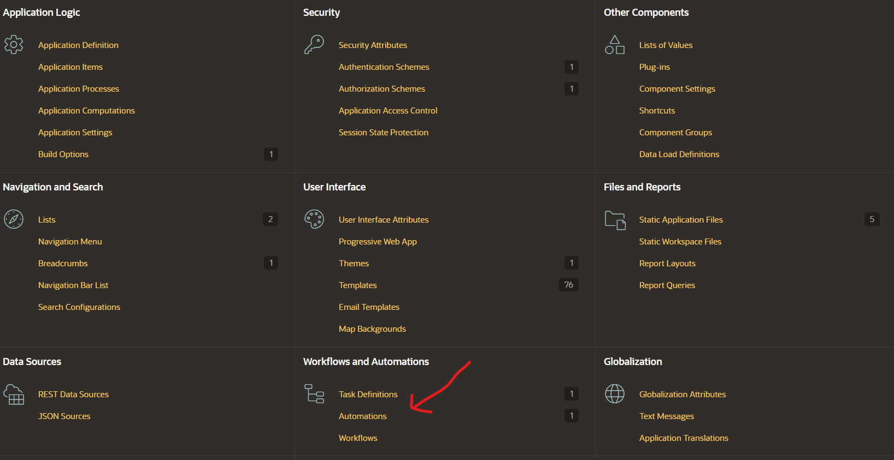

# Automatizaciones en Oracle APEX v24

## Contenido

- Introducción
- Creación de una automatización.
    - Explicación Detallada de los Campos en “Create Automation”
- Configura tu Automatización.
    - Explicación de los Campos
- Configuración de Acciones en la Automatización
    - **Manejo de Errores en Automatizaciones**
    - Server Side Condition (Condición del Lado del Servidor)
- Conclusión

## Introducción

Automatización (Automations) en Oracle APEX (versión 20.2) permite automatizar tareas recurrentes como envío de notificaciones, actualización de datos o procesos por lotes, sin necesidad de programar manualmente con **DBMS_SCHEDULER**.

Funciona como una interfaz simplificada y potente para programar acciones automáticas, mejorando la eficiencia y facilitando la gestión de procesos dentro de las aplicaciones.

## Creación de una automatización

Para esta guía es una continuación de **Definicion de Tareas en Oracle APEX v24 Parte I,** por lo tanto, utilizaremos la aplicación **Blog - Task Definition. Una vez que estemos en la aplicación accedemos a Shared Components** y selecciona **Automations** (Automatización).

Después de hacer clic en **Automations,** selecciona **Create** para iniciar la creación de una automatización nueva.

Después de hacer clic, se mostrará la siguiente pantalla.

### Explicación Detallada de los Campos en “Create Automation”

1. **Name**: aquí debes ingresar el nombre de la automatización. Este nombre identifica la tarea automatizada dentro de Oracle APEX. En esta guía el nombre de la tarea es **Blog - Automation**.
2. **Type**: 
    - **On Demand**: la automatización solo se ejecuta manualmente o cuando se llama explícitamente mediante el paquete `APEX_AUTOMATION`.
    - **Scheduled**: la automatización se ejecutará automáticamente según la frecuencia programada en el campo **Execution Schedule**. Si eliges on **On Demand**, la opción **Execution Schedule** desaparece porque no se necesita un horario de ejecución.

 ****3. **Actions Initiated On:**

- **Query:** Las acciones se ejecutarán solo si la consulta SQL definida devuelve resultados. Los datos devueltos pueden usarse dentro de las acciones.
- **Always:** Las acciones se ejecutarán siempre que la automatización se active, sin depender de ningún resultado de consulta.

 **4. Execution Schedule:** *(Solo visible si seleccionas **Scheduled**)*

- **Every 15 Minutes:** La automatización se ejecuta cada 15 minutos.
- **On the Hour:** La automatización se ejecuta al inicio de cada hora.
- **Daily at Midnight:** La automatización se ejecuta todos los días a la medianoche.
- **Custom:** Permite configurar un horario personalizado mediante expresiones cron o intervalos específicos.

Le damos clic en **Create** para avanzar a la configuración de acciones y condiciones.

## Configura tu Automatización

Una vez creada la automatización **Blog - Automation**, accedemos a la pestaña **Name**, donde se presenta tres campos:

- **Name:** nombre de la automatización.
- **Static ID:** identificador único usado para ejecutar la automatización manualmente con `APEX_AUTOMATION.EXECUTE`.
- **Currently Executing:** indica si la automatización se está ejecutando en ese momento.

La configuración de una automatización en Oracle APEX permite definir cómo y cuándo se ejecutarán tareas automáticas dentro de una aplicación. Esta sección proporciona opciones avanzadas para personalizar el comportamiento de la automatización, estableciendo condiciones de ejecución y gestionando su estado. A continuación, se explica los campos clave en la pestaña **Settings**.

### Explicación de los Campos

1. **Type:**
    - **Scheduled:** La automatización se ejecutará automáticamente según la frecuencia establecida.
    - **On Demand:** La automatización solo se ejecutará cuando se invoque manualmente mediante el paquete `APEX_AUTOMATION.EXECUTE`.
2. **Schedule Expression:**
    
    Permite definir horarios de ejecución repetitivos utilizando la sintaxis de calendario del **Database Scheduler**.
    
    - Ejemplos:
        - "Cada martes y viernes a las 4:00 p.m."
        - "El segundo miércoles de cada mes".
    - Se puede ingresar manualmente o usar el **Interval Builder** (ícono de herramienta) para crear expresiones simples.
    - Para programaciones más complejas, se recomienda consultar la documentación del paquete **DBMS_SCHEDULER**.
3. **Schedule Status:**
    
    Indica el estado actual de la programación de la automatización.
    
    - **Active:** La automatización se ejecutará según la programación establecida.
    - **Disabled:** La programación está desactivada, pero la automatización puede ejecutarse manualmente.
    - **Error:** La programación se ha desactivado debido a un error en la última ejecución, aunque puede ejecutarse manualmente.
4. **Actions Initiated On:**
    
    Define el origen de datos que activa las acciones de la automatización.
    
    - **Query:** Se ejecuta una consulta SQL. Las acciones se realizan por cada fila encontrada o una sola vez si no se encuentran datos.
    - **PL/SQL Returning Boolean:** Se ejecuta un bloque PL/SQL que devuelve un valor booleano. Si retorna **TRUE**, se ejecutan las acciones.
    - **Always:** Las acciones se ejecutan siempre, ideal cuando se configura con un horario programado, independientemente de la presencia de datos.

## Configuración de Acciones en la Automatización

Las **acciones** en una automatización de Oracle APEX definen las tareas específicas que se ejecutarán cuando se cumplan ciertas condiciones establecidas en la automatización. Estas acciones son fundamentales para automatizar procesos como el envío de notificaciones, actualizaciones de datos o la ejecución de procedimientos personalizados.

Una vez configurada la automatización, se pueden agregar y editar acciones para determinar qué tareas se realizarán y cómo se ejecutarán.

Depsues de darle clic en el botón **Add Action** nos aparecera la pestaña de **Edit Action** y nos dirigimos a la pestaña **Action**.

1. **Name**: Aquí debes ingresar un nombre para la acción de automatización. Este nombre te ayudará a identificar la acción dentro de tu flujo de trabajo.
2. **Type**: Selecciona el tipo de acción que deseas que se ejecute. Las opciones comunes son:
    - **Execute Code**: Ejecuta un bloque de código PL/SQL.
    - **Send E-Mail**: Envia un correo electrónico a los destinatarios especificados.
    - **Send Push Notification**: Envía una notificación push a un usuario de la aplicación.
3. **Execution Sequence**: Determina el orden en el que se deben ejecutar las acciones dentro de la automatización.

### **Manejo de Errores en Automatizaciones**

La pestaña **Error Handling** en las automatizaciones permite configurar cómo manejar los errores que puedan surgir durante la ejecución de la acción. Puedes definir un **mensaje de error** que se mostrará en el registro de la automatización cuando la acción no se ejecute correctamente. Es recomendable incluir `#SQLERRM#` en el mensaje, ya que esta es una variable de sustitución que insertará el mensaje de error real generado por Oracle.

Además, hay una opción llamada **Stop Execution on Error**. Si habilitas esta opción, la ejecución de la automatización se detendrá al encontrar un error en el procesamiento de la fila actual. Esto significa que no se ejecutarán acciones adicionales después de que se haya producido el error, lo cual es útil si deseas prevenir que errores adicionales ocurran debido a una tarea fallida.

### Server Side Condition (Condición del Lado del Servidor)

La opción **Server Side Condition** en automatizaciones permite agregar una condición que debe cumplirse antes de que la acción se ejecute en el servidor. Aquí, puedes seleccionar el tipo de condición que deseas aplicar. Esto es útil cuando deseas que la acción solo se ejecute si se cumplen ciertos criterios, como la validación de una variable o el estado de un proceso o de datos en particular. Esta condición asegura que las acciones dentro de la automatización se ejecuten solo cuando se den las condiciones necesarias, optimizando así el flujo de trabajo.

La opción **Do not validate code (parse at runtime only)** en la **Server Side Condition** permite que el código de la condición no se valide en tiempo de diseño, sino que se valide en el momento de la ejecución, lo que puede ser útil cuando el código depende de condiciones dinámicas o datos que solo se conocen durante la ejecución.

La opción **Execute For Each Row** especifica si la condición debe ejecutarse para cada fila de datos que devuelve la consulta o solo una vez. Si se selecciona esta opción, la condición se evaluará por cada fila individualmente, lo que permite una mayor flexibilidad y control sobre las acciones que se ejecutan en función de los datos específicos de cada fila.

## Conclusión

En resumen, las **Automations** en Oracle APEX permiten automatizar tareas como el envío de correos, notificaciones push y ejecución de código sin intervención manual. Puedes configurar acciones basadas en horarios, condiciones específicas o datos de consulta. Con la integración de **APEX_AUTOMATION** y **DBMS_SCHEDULER**, las tareas se ejecutan automáticamente o bajo demanda, ahorrando tiempo y reduciendo errores. Además, puedes gestionar el manejo de errores y establecer condiciones para ejecutar acciones solo cuando se cumplan ciertos criterios. Las automaciones optimizan procesos repetitivos y mejoran la eficiencia operativa de las aplicaciones.