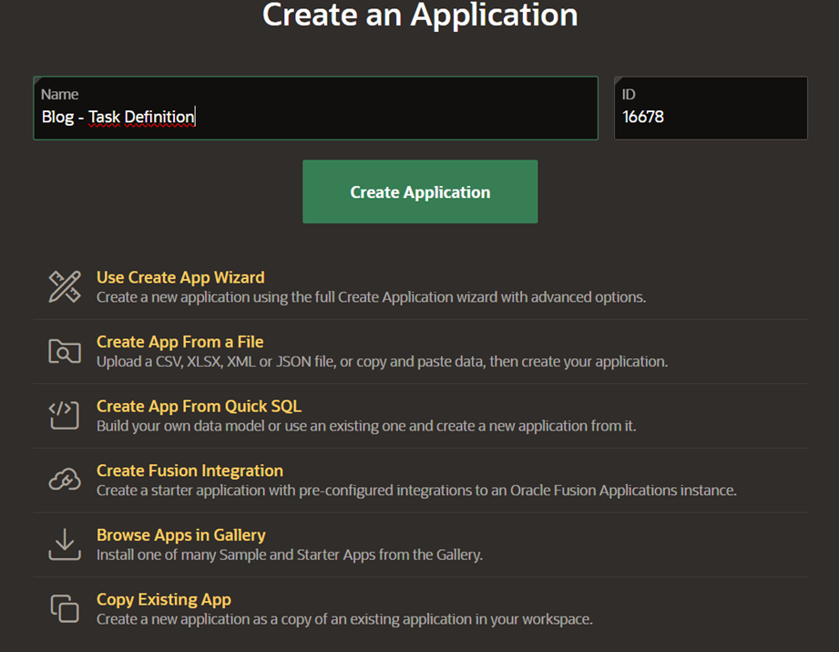

# Definicion de Tareas (Task Definition) en Oracle Apex v24 - Parte I

## Contenido

1. Introducción.
2. Crea una aplicación en tu WorkSpace en Oracle APEX.
3. Especifica el Plazo de tu Tarea.
4. Asignación de responsables para completar la tarea.
5. Agrega parámetros.
6. Configuración de Acciones en la Tarea.
    1.    Enviar Notificación Push: Send Push Notification
    2.    On Event: Especificación de Eventos para Ejecutar Acciones
    3.    Success Message
    4.    Error Handling
    5.    Stop Execution On Error
    6.    Log Messages When
    7.    Server Side Condition
7. Runtime Views for Tasks
8. Conclusión.

## Inicio

La funcionalidad Task Definition fue introducida en la versión 22.1 de Oracle APEX. Esta característica permite definir tareas que son iniciadas por un usuario y aprobadas o rechazadas por otro. En esta guía aprenderás a crear una tarea y a implementarla en tus aplicaciones.

## Crea una aplicación en tu WorkSpace en Oracle APEX

Antes de crear un **Task Definition**, primero crearemos una aplicación en nuestro espacio de trabajo de Oracle APEX.

Una vez creada la aplicación **Blog -  Task Definition**, accede a **Shared Components** para continuar con la configuración.

Seguidamente, ingresa a **Workflows and Automations** y Selecciona **Task Definitios** para crear y administrar tus tareas.

Después de hacer clic en **Task Definitions**, selecciona **Create** para iniciar la creación de una nueva tarea.

Después de hacer clic, se mostrará la siguiente pantalla.

Para crear la tarea, debemos completar los campos correspondientes. En este caso, la tarea se llamará **Blog Task**.

Type se refiere al tipo de tarea. Oracle APEX ofrece dos tipos: Approval Task y Action Task.

- Una **Approval Task** permite aprobar, rechazar o delegar la tarea.
- Una **Action Task** requiere ejecutar una acción específica, como subir un archivo, lo cual marca la tarea como completada.

**Subject** define el tema o descripción de la tarea cuando se crea. Por ejemplo:

*"Aumentar el sueldo del empleado &EMPLOYEE_NAME de &OLD_SALARY a &NEW_SALARY."*

Si se crea una tarea para aumentar el sueldo del empleado José de $1000 a $2000, el mensaje sería:

*"Aumentar el sueldo del empleado José de $1000 a $2000."*

**Priority** establece la prioridad de la tarea, donde **1** es prioridad alta y **5** es prioridad baja. Esto es útil para que los participantes gestionen sus tareas según la importancia.

**Potential Owner** y **Business Administrator** son roles con diferentes niveles de privilegio:

- **Potential Owner:** Usuario o grupo autorizado para reclamar y completar la tarea. Una vez reclamada, otros **Potential Owners** no podrán gestionarla.
- **Business Administrator:** Usuario o grupo con permisos avanzados para gestionar tareas, incluso si no son propietarios. Pueden reasignar tareas, modificar estados o intervenir para asegurar su cumplimiento.

Es importante asignar al menos un usuario a alguno de estos roles. Los campos **Name** y **Subject** son obligatorios, mientras que **Potential Owner** y **Business Administrator** son opcionales.

Una vez creada la tarea **Blog Task**, accederemos a la página donde podremos configurar el plazo de la tarea, asignar participantes, definir parámetros, establecer la fuente de datos y programar acciones.

En la pestaña **Name**, es posible modificar el nombre de la tarea. En este caso, mantendremos el nombre original de la tarea y su ID estático sin cambios. 

Posteriormente, accedemos a la pestaña **Setings** (Ajustes) para continuar con la configuración de la tarea.

**En esta pestaña**, se muestra el tipo de tarea seleccionado durante su creación. En nuestro caso, elegimos un **Approval Task**. Es importante destacar que el campo **Type** no se puede modificar después de crear la tarea.

La opción **Initiator Can Complete**, si está activada, permite que el usuario que inició la tarea también pueda aprobarla o rechazarla.

El campo **Subject** se puede modificar para agregar información adicional que facilite la comprensión de la tarea a los usuarios con roles de **Potential Owner** o **Business Administrator**. Además, se puede ajustar la **Prioridad** de la tarea según su urgencia.

Otro campo opcional es **Task Details Page Number**, que permite generar una página específica para la tarea.

Si te preguntas qué representan **&EMPLOYEE_NAME**, **&OLD_SALARY** o **&NEW_SALARY**, estos son valores dinámicos provenientes de columnas de una consulta SQL. Para utilizarlos, es necesario seleccionar la opción **SQL Query** o **Table**. También pueden ser parámetros definidos dentro de la tarea.

## Especifica el plazo de tu tarea

En un **Task Definition** es posible establecer un plazo de vencimiento para la tarea. Al momento de crearla, el campo **Due On Type** se configura por defecto en **None**, lo que indica que la tarea no tiene un límite de tiempo definido. Esto significa que la tarea permanecerá activa indefinidamente hasta que sea aprobada o rechazada.

Para garantizar que las tareas se gestionen de manera oportuna, se recomienda asignar un plazo adecuado según la prioridad y el flujo de trabajo.

La opción **Interval** utiliza el formato **Interval ISO** (según la norma ISO 8601). Un ejemplo de este formato es `PT12H` , lo que significa que la tarea vencerá después de 12 horas. Además, se pueden elegir otras opciones para definir el vencimiento, como **SQL Query, Function Body**, **Exoression** y **Scheduler Expression**. 

En cuanto a la **Expiration Policy**, su valor predeterminado es **None**, pero podemos modificarlo a **Expire** o **Renew.** Si seleccionamos **Expire**, la tarea entrará en un estado de vencimiento a una vez que haya pasado el plazo establecido. Si elegimos **Renew,** podemos configurar cuántas veces se puede renovar la tarea antes de que entre en estado de vencimiento.

## Asignación de responsables para completar la tarea.

Para que una tarea sea efectiva, es esencial asignar uno o más participantes que podrán iniciar, reclamar, aprobar o rechazar la tarea. Los **participantes** pueden ser asignados de acuerdo con los roles y permisos establecidos en la tarea, como **Potential Owner** o **Business Administrator**.

- **Potential Owner**: Son los usuarios o grupos de usuarios que tienen la capacidad de reclamar y completar la tarea. Solo el **Potential Owner** que haya reclamado la tarea podrá cambiar su estado, por lo que es importante asignar a las personas adecuadas para evitar confusiones.
- **Business Administrator**: Son los usuarios con privilegios más elevados que pueden intervenir en la gestión de la tarea, incluso si no son los propietarios. Los **Business Administrator** pueden reasignar tareas, modificar su estado y supervisar que todo el proceso se cumpla correctamente.

Al añadir participantes, asegúrate de definir bien sus roles para que cada uno sepa claramente qué acciones puede realizar sobre la tarea.

Además, podemos especificar qué usuarios estarán involucrados en el flujo de la tarea utilizando el campo **Value Type**. Las opciones disponibles para determinar los participantes son las siguientes:

1. **Static**: Permite asignar un participante estático, es decir, un usuario específico, directamente en el campo. Aquí solo deberás ingresar el nombre del participante.
2. **SQL Query**: Esta opción te permite realizar una consulta SQL a una tabla de usuarios para obtener uno o varios participantes dinámicamente. Puedes consultar a una tabla de usuarios con roles específicos o basado en ciertos criterios.
3. **Function Body**: Aquí puedes llamar a una función que devuelva un usuario o un grupo de usuarios. La función debe estar definida en la base de datos y puede ser personalizada para devolver resultados según condiciones específicas.
4. **Expression**: Permite definir una expresión lógica para asignar participantes. Por ejemplo, puedes configurar una expresión que asigne un participante basado en si el usuario actual es `USER_TWO`.

Estas opciones de **Value Type** ofrecen flexibilidad para determinar de manera dinámica los participantes que podrán **reclamar, aprobar, rechazar o administrar** las tareas.

## Agrega parámetros

Es posible añadir **parámetros** a la tarea para personalizar la información que se utiliza en el **Subject** o en las **acciones** asociadas a la tarea. Los parámetros proporcionan un mecanismo flexible para pasar valores dinámicos que pueden cambiar según el contexto de cada tarea.

Por ejemplo, si quieres personalizar el mensaje del **Subject** de la tarea, puedes utilizar parámetros como `&EMPLOYEE_NAME` o `&SALARY_INCREASE` para reflejar valores específicos de la tarea en cada instancia. De esta forma, cada tarea podrá mostrar información relevante y específica cuando sea creada o gestionada.

**¿Cómo se usan los parámetros?**

1. **En el Subject**: Se pueden incluir parámetros en el campo **Subject** para personalizar el mensaje, como se mostró en ejemplos anteriores, donde se incluyeron valores como el nombre del empleado o el salario.
2. **En las Acciones**: Los parámetros también pueden ser utilizados en las **acciones** de la tarea, como parte de los criterios o en los valores que se pasan a las operaciones de negocio.

**Definir Parámetros para la Tarea**

Los parámetros en Oracle APEX Task Definitions son de tipo **String**, y deben ser definidos con un **Static ID** único para que puedan ser utilizados más adelante en el **Subject** de la tarea o en las **acciones** asociadas. Este **Static ID** es esencial para referirse al parámetro de manera consistente en diferentes contextos de la tarea.

Además de definir el **Static ID**, hay tres configuraciones adicionales que puedes especificar para cada parámetro:

1. **Requerido**: Si seleccionas esta opción, el parámetro debe ser completado antes de que la tarea pueda avanzar. Es decir, el parámetro no puede quedar vacío.
2. **Visible**: Al activar esta opción, el parámetro será visible para los usuarios cuando interactúen con la tarea. Esto es útil para mostrar información relevante al participante de la tarea.
3. **Actualizable**: Si se habilita esta opción, el valor del parámetro puede ser modificado por los usuarios durante el flujo de trabajo de la tarea.

Con estas opciones, puedes controlar cómo y cuándo se utilizan los parámetros dentro de la tarea, asegurando que la información requerida se recoja correctamente y sea accesible para quienes gestionen la tarea.

## Configuración de Acciones en la Tarea

Las **acciones** son operaciones específicas que se ejecutan en respuesta a eventos que ocurren durante el flujo de trabajo de una tarea. Estas acciones permiten automatizar ciertas tareas y hacer que el proceso sea más eficiente. Por ejemplo, una acción puede ser el envío de una notificación, la actualización de un campo o la asignación de una nueva tarea a un usuario.

Cada tarea puede tener múltiples acciones asociadas, las cuales se ejecutan en un orden determinado. Este orden se define mediante el **Execution Sequence** (secuencia de ejecución), que determina el orden en que las acciones se llevarán a cabo cuando el evento correspondiente ocurra. Es importante organizar las acciones correctamente para garantizar que se ejecuten en el momento adecuado y en la secuencia deseada, ya que esto influye directamente en el flujo de trabajo de la tarea.

**Acción: INCREMENT_SALARY**

En este caso, hemos creado una acción llamada **INCREMENT_SALARY**. En el campo **Type**, seleccionamos el tipo de acción que se llevará a cabo. Si elegimos **Execute Code**, esto permitirá ejecutar código **PL/SQL** o consumir un servicio **REST** dependiendo de lo que se necesite en ese momento.

En este ejemplo, la acción utiliza un código **DML** (Data Manipulation Language) que actualiza el salario del usuario. Es importante señalar que **APEX$TASK_PK** se refiere a la clave primaria de la tarea, la cual se utiliza en la consulta dentro de la pestaña **Setting**, específicamente en el campo **Action SQL Query**, donde se configura la consulta SQL que se ejecutará al activar la acción.
Este tipo de acción permite modificar datos directamente en la base de datos, lo que hace que sea una herramienta muy poderosa para automatizar tareas en Oracle Apex.

Notificación por Correo: Send E-Mail

Si queremos enviar una notificación por correo electrónico como parte de la acción de nuestra tarea, podemos elegir la opción **Send E-Mail**. Al seleccionar esta opción, se abrirán campos adicionales donde deberemos completar la información necesaria, como el **destinatario**, el **asunto** y el **cuerpo del mensaje**.

Además, podemos aprovechar las plantillas de correo electrónico (**Email Template**) para hacer que la notificación sea más personalizada y profesional. Estas plantillas permiten incluir información dinámica, como el nombre del usuario o detalles específicos de la tarea, facilitando la personalización del mensaje sin tener que escribir todo el contenido manualmente.

Este enfoque mejora la automatización del proceso, ya que el sistema puede enviar correos electrónicos a los participantes de la tarea en momentos clave, como cuando se crea, se aprueba o se completa la tarea.

### **Enviar Notificación Push: Send Push Notification**

La opción **Send Push Notification** permite enviar notificaciones directamente a los usuarios de la aplicación, en lugar de hacerlo por correo electrónico. Este tipo de notificación es especialmente útil cuando queremos alertar a los usuarios sobre eventos importantes dentro de la aplicación, como la aprobación de una tarea.

Por ejemplo, si un usuario ha solicitado un incremento en su salario y la tarea se aprueba, podemos configurar una notificación push para que el usuario reciba una alerta en tiempo real, informándole sobre el cambio en el estado de la tarea. Esta notificación puede ser personalizada con detalles como el nombre del usuario, el monto aprobado, entre otros, para hacerla más relevante.

Las notificaciones push son útiles para mantener a los usuarios actualizados al instante, incluso cuando no están directamente interactuando con la aplicación en ese momento, mejorando la experiencia de usuario.

### On Event: Especificación de Eventos para Ejecutar Acciones

La opción **On Event** permite definir que la acción se ejecute cuando ocurra un evento específico relacionado con la tarea. Dependiendo del tipo de tarea y el flujo de trabajo, se pueden seleccionar distintos eventos que activarán la acción.

Existen varios tipos de eventos disponibles, como:

- **Claim (Reclamar):** ocurre cuando un posible propietario toma posesión de la tarea, cambiando su estado de **No Asignada** a **Asignada**.
- **Complete (Completar):** Se ejecuta cuando la tarea se completa. En tareas de aprobación, puede configurarse para ejecutarse solo si el resultado es **Aprobado** o **Rechazado**.
- **Delegate (Delegar):** Se activa cuando la tarea se delega a otro posible propietario.
- **Update Comment (Actualizar Comentario):** Se ejecuta cuando se añade un comentario a la tarea.
- **Update Priority (Actualizar Prioridad):** Ocurre cuando se cambia la prioridad de la tarea.
- **Update Parameter (Actualizar Parámetro):** Se ejecuta al actualizar los parámetros de la tarea.
- **Release (Liberar):** Se activa cuando la tarea es liberada, cambiando su estado de **Asignada** a **No Asignada**.
- **Cancel (Cancelar):** Ocurre cuando la tarea se cancela, indicando que ya no se tiene interés en completarla.
- **Create (Crear):** Se ejecuta cuando la tarea es creada.
- **Request Information (Solicitar Información):** Se activa cuando el iniciador de la tarea solicita información adicional.
- **Submit Information (Enviar Información):** Se ejecuta cuando el iniciador proporciona la información solicitada.
- **Before Expire (Antes de Vencer):** Ocurre antes de que se alcance la fecha límite de la tarea. Requiere especificar un intervalo de tiempo ISO/SQL.
- **Expire (Vencimiento):** Se activa cuando la fecha de vencimiento de la tarea se cumple y la tarea expira.

### **Success Message (Mensaje de Éxito)**

El **Success Message** es un mensaje que se muestra cuando una acción se ejecuta correctamente. Este mensaje confirma que la operación solicitada se completó con éxito, proporcionando claridad y asegurando al usuario que el proceso ha sido ejecutado sin problemas.

Es importante personalizar este mensaje para que sea claro y útil para el usuario. Por ejemplo, si la acción es un incremento de salario, el mensaje de éxito podría ser: "El salario de &EMPLOYEE_NAME ha sido actualizado correctamente.”

### **Error Handling (Manejo de Errores)**

La pestaña **Error Handling** permite especificar un mensaje que se mostrará si la acción no se ejecuta correctamente. Este mensaje es crucial para informar al administrador sobre el problema que ha ocurrido. El mensaje que introduzcas se guardará automáticamente en el **Task History**, lo que facilita el seguimiento y la depuración de tareas fallidas.

### Stop Execution On Error (Detener Ejecución en Caso de Error)

Cuando la opción **Stop Execution On Error** está activada, la ejecución de la tarea se detendrá inmediatamente en el momento en que ocurra un error. Esta opción es útil cuando quieres asegurarte de que, si se produce una falla durante la ejecución de una acción, el sistema no continúe con el proceso de manera incorrecta. Esto puede ser importante para prevenir errores adicionales y garantizar que el proceso se detenga antes de que se realicen más cambios indeseados.

### Log Messages When (Registrar Mensajes Cuando)

La opción **Log Messages When** determina cuándo se deben registrar los mensajes en el **Task History**. Hay cuatro opciones disponibles:

- **None**: No se registrarán mensajes en el historial de la tarea.
- **Success**: Solo los mensajes relacionados con el éxito de la acción serán registrados.
- **Failure**: Solo los mensajes de error serán registrados, lo que puede ser útil para detectar y corregir problemas rápidamente.
- **All**: Se registrarán tanto los mensajes de éxito como los de error, lo que proporciona un historial completo y detallado de todas las ejecuciones de la tarea.

### Server Side Condition (Condición del Lado del Servidor)

La opción **Server Side Condition** permite agregar una condición que debe cumplirse antes de que se ejecute la acción en el servidor. Aquí debes elegir el tipo de condición que deseas aplicar. Esto es útil cuando solo deseas ejecutar ciertas acciones si se cumplen criterios específicos, como la verificación de una variable o el estado de un proceso en curso.

Las palabras en color amarrillo son los tipos de condiciones disponibles, dependiendo que tipo de condición elegimos tendremos que llenar ciertos campos, la condición si se cumple entonces la acción se ejecutara y la condición no se cumple entonces no se ejecutara la acción actual.

Al elegir una de las siguientes condiciones (en color amarillo en el sistema), deberás especificar los valores correspondientes para que se realice la comparación o validación:

- **APP_USER**: Se refiere al usuario que está actualmente autenticado en la aplicación.
- **USER_ONE**: Es un valor específico que podría estar relacionado con un nombre de usuario, rol o algún otro identificador.

En el ejemplo de la imagen, si la condición es `:APP_USER = 'USER_ONE`', esto significa que la acción solo se ejecutará si el usuario autenticado (`APP_USER`) es igual al valor definido como `USER_ONE`. Si no se cumple esta condición, la acción no se ejecutará.

**Ejemplo Práctico**:
Si deseas que la acción solo se ejecute cuando el usuario actual sea **USER_ONE**, asegúrate de configurar la condición de la siguiente forma:

- **Tipo de Condición**: `APP_USER`
- **Valor a Comparar**: `USER_ONE`

Si el usuario que ejecuta la tarea es **USER_ONE**, la acción será ejecutada; de lo contrario, no lo será.

# **Runtime Views for Tasks**  

Aprende sobre las vistas `APEX_TASKS`, `APEX_TASK_COMMENTS`, `APEX_TASK_HISTORY`, `APEX_TASK_PARAMETERS` y `APEX_TASK_PARTICIPANTS`.

# **Runtime Views for Tasks**  

Oracle APEX nos proporciona varias vistas que almacenan la configuración de las definiciones de tareas dentro de una aplicación en Oracle APEX, el propósito de estas vistas es acceder a información histórica de una definición de tarea o varias que han sido definidas, que son las siguientes:

| **Vista**                      | **Descripción**  |
|--------------------------------|------------------------------------------------------------------------------------------------------------------------------------|
| `APEX_TASKS`                   | Propiedades de cada instancia de tarea.  |
| `APEX_TASK_COMMENTS`           | Todos los comentarios ingresados en cada instancia de tarea.  |
| `APEX_TASK_HISTORY`            | Serie cronológica de operaciones realizadas en una tarea, incluyendo el usuario y la fecha de actualización.  |
| `APEX_TASK_PARAMETERS`         | Parámetros definidos en una tarea junto con sus valores en tiempo de ejecución en formato String.  |
| `APEX_TASK_PARTICIPANTS`       | Lista de participantes en una tarea. Puede diferir de la lista original si los administradores agregan o eliminan participantes. |

## Conclusión

En resumen, Task Definitions es útil cuando se busca gestionar flujos de trabajo de manera eficiente, asignando tareas, controlando plazos y acciones, y garantizando un seguimiento preciso de las tareas dentro de un proceso automatizado.
